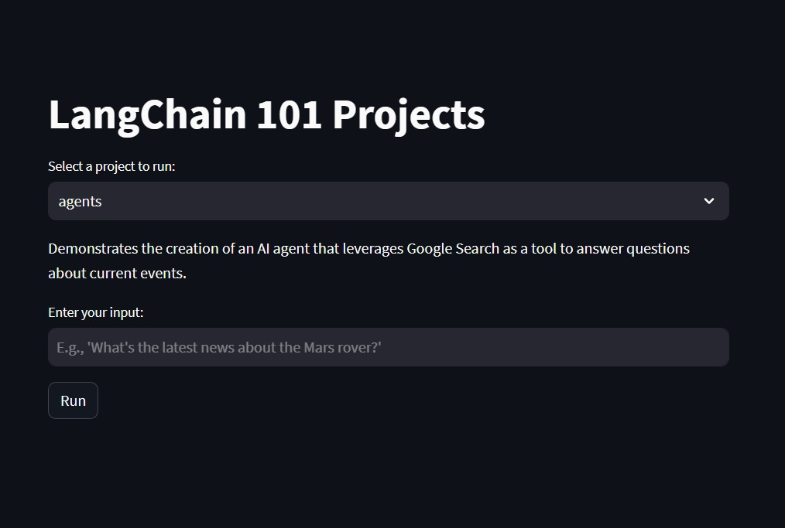

# LangChain 101 - from Zero to Hero

This repository contains various projects demonstrating the integration and usage of the LangChain framework with OpenAI and ActiveLoop.

You can access the deployed version [here](https://langchain101-fromzerotohero-fpgypzev42wbq7ivey6y2a.streamlit.app/).



## Setup

1. **Environment Variables**: Rename the `.env copy` file to `.env`.

2. **API Keys**:
   - Obtain your OpenAI API key from [OpenAI Platform](https://platform.openai.com/account/api-keys) and input it into the `.env` file.
   - Obtain your ActiveLoop API key from [ActiveLoop](https://app.activeloop.ai/register) and input it into the `.env` file.
   - Obtain your Google Search API key from [Google Search](https://python.langchain.com/docs/integrations/tools/google_search) and input it in the `.env` file

3. **Requirements**: Install the necessary packages using:
   ```
   pip install -r requirements.txt
   ```

## File Structure

```
.
│   .env copy
│   README.md
│   requirements.txt
│   screenshot.jpeg
│   
└───projects
    │   agents.py
    │   app.py
    │   chains.py
    │   llms.py
    │   memory.py
    │   tools.py
    │   vector_store.py
```

## Project Descriptions

1. **tools.py**: Demonstrates the usage of the OpenAI language model for text summarization and integrates Google Search API as a tool for the AI agent.

2. **memory.py**: Showcases a conversation chain with memory, allowing for continuous interactions.

3. **llms.py**: A simple script to demonstrate the usage of the OpenAI language model to suggest a personalized workout routine.

4. **chains.py**: Illustrates the creation of a chain using the OpenAI language model to suggest company names based on a given product.

5. **vector_store.py**: Demonstrates the creation and usage of the DeepLake vector store with the OpenAI language model and embeddings.

6. **agents.py**: Demonstrates the creation of an AI agent that leverages Google Search as a tool to answer questions about current events.

7. **app.py**: Streamlit application to interactively run the projects.

## Running the Projects

To run any of the scripts inside the `projects` folder, use:

```
python projects/<script_name>.py
```

For example, to run the `tools.py` script, use:

```
python projects/tools.py
```

To run the Streamlit app:

```
streamlit run projects/app.py
```

## Notes

- Ensure that all environment variables are correctly set in the `.env` file before running the scripts.
- Modify the scripts as needed to fit your specific use cases or to experiment with different configurations.

## Acknowledgments

This project was created by following the ActiveLoop tutorial on [LangChain 101: From Zero to Hero](https://learn.activeloop.ai/courses/take/langchain/multimedia/46317643-langchain-101-from-zero-to-hero).