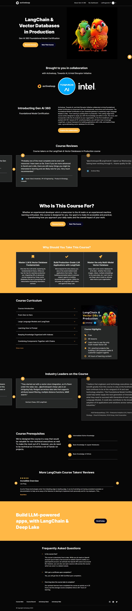

# LangChain & Vector Databases Learning Repository

This repository is dedicated to my learning journey through the [LangChain & Vector Databases in Production](https://learn.activeloop.ai/courses/langchain) course offered by Activeloop. The course is part of the Gen AI 360 Foundational Model Certification and focuses on mastering Large Language Models (LLMs) and Vector Databases.

## Course Overview

- **LangChain**: A robust framework for building applications with LLMs.
- **Vector Databases**: Understanding Deep Lake, a groundbreaking vector database for all AI data.
- **Projects**: 10+ practical projects to build real-world applications.
- **Duration**: 40+ hours of learning content.

## What's Inside This Repository

- **Code Snippets**: Various code examples and exercises from the course.
- **Projects**: Complete projects developed during the course.
- **Notes**: Personal notes and insights related to LangChain and Vector Databases.

## How to Use This Repository

Feel free to explore the code and projects. If you have any questions or suggestions, please open an issue or submit a pull request.

## Progress

### Completed Modules
- [x] Course Introduction
- [x] From Zero to Hero
- [x] Large Language Models and LangChain
- [x] Learning How to Prompt
- [x] Keeping Knowledge Organized with Indexes
- [x] Combining Components Together with Chains
- [x] Giving Memory to LLMs
- [x] Making LLMs Interact with the World Using Tools
- [x] Using Language Model as Reasoning Engines with Agents

## License

This project is licensed under the MIT License - see the [LICENSE.md](LICENSE.md) file for details.

## Acknowledgments

- Thanks to Activeloop for providing this comprehensive course.
- Special shoutout to the community and fellow learners for the support and collaboration.

---

Feel free to connect with me on [LinkedIn](https://www.linkedin.com/in/letlhogonolo-fanampe-32ba9540/) or follow me on [GitHub](https://github.com/djpapzin).

Happy Learning!

